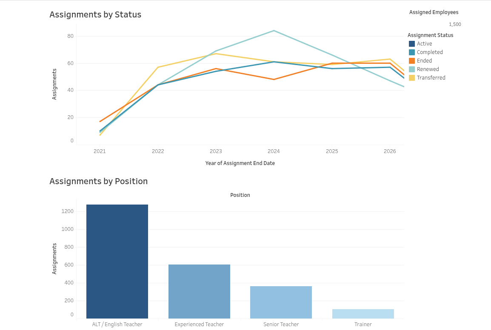
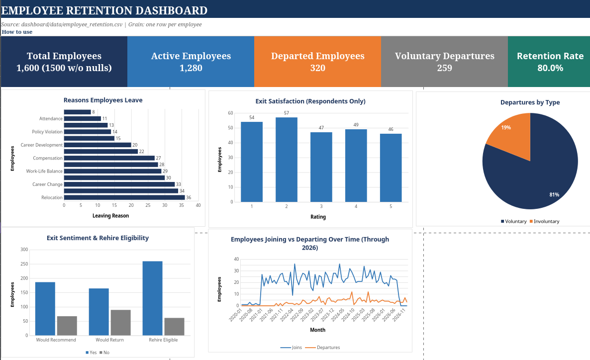

# Workforce Lifecycle & Retention Analytics


## Table of Contents

- [1. Project Objective](#1-project-objective)
- [2. Business Scenario](#2-business-scenario)
- [3. The Two Dashboards](#3-the-two-dashboards)
  - [3.1 Workforce Dashboard On tableau](#31-workforce-dashboard-on-tableau)
  - [3.2 Employee Retention Dashboard on Excel](#32-employee-retention-dashboard-on-excel)
  - [3.3 How the Dashboards Fit Together](#33-how-the-dashboards-fit-together)
- [4. Quick Project Summary](#4-quick-project-summary)
- [5. Business Questions](#5-business-questions)
- [6. Data](#6-data)
- [7. Repository Structure](#7-repository-structure)
- [8. SQL](#8-sql)
- [9. Python](#9-python)
- [10. Jupyter Notebooks](#10-jupyter-notebooks)
- [11. Dashboard Data](#11-dashboard-data)
- [12. Documentation](#12-documentation)
- [13. Analytical Workflow](#13-analytical-workflow)
- [14. Data Quality](#14-data-quality)
- [15. Business Insights and Recommendations](#15-business-insights-and-recommendations)
- [16. Limitations](#16-limitations)
- [17. Git Workflow](#17-git-workflow)

---

## 1. Project Objective

This is an end-to-end Data Analytics portfolio project focused on **workforce management, employee experience, client satisfaction, and employee retention** within a fictional Japan-based ALT / English-teacher dispatch company.

The goal is not simply to produce charts or SQL queries. The project demonstrates the ability to:

**Understand a business problem → work with imperfect data → validate and clean data → analyze it → communicate findings → make evidence-based recommendations.**

All data is synthetic and created for educational and portfolio purposes.

---

## 2. Business Scenario

The fictional company, DaimonUpDown Education, recruits, hires, trains, and dispatches ALT and English teachers to schools and educational organizations, primarily in Tokyo and surrounding areas such as Saitama, Chiba, and Kanagawa.

The teacher lifecycle is:

```text
Recruitment
    ↓
Hiring
    ↓
Onboarding
    ↓
Training
    ↓
Assignment / Dispatch
    ↓
Employment
    ↓
Employee Experience
    ↓
Performance
    ↓
Retention / Turnover
    ↓
Offboarding
```

At the same time, the company needs to understand the experience of the schools and educational organizations receiving dispatched teachers.

The business wants to understand:

- workforce and assignment operations
- employee satisfaction and experience
- teacher performance
- client/school satisfaction
- assignment stability and renewal
- employee retention
- employee turnover
- operational bottlenecks

The project therefore looks at the employee side and the client side together.

A central relationship being investigated is:

**Employee Experience → Teacher Performance → Client Experience → Assignment Renewal → Retention**

This is an analytical relationship to investigate, **not a claim of causation**.

---

## 3. The Two Dashboards

The project has **two main dashboards**, each answering a different business problem.

### 3.1 Workforce Dashboard on Tableau
[View the Workforce Dashboard on Tableau Public](https://public.tableau.com/app/profile/j.d1004/viz/WorkforceDashboard_17872800689950/Dashboard1)




The **Workforce Dashboard** focuses on the operational side of teacher assignments and dispatch.

Its purpose is to answer questions such as:

- How many employees are represented in assignment data?
- Which positions have the most assignment records?
- How are assignments distributed by status?
- What assignment outcomes are occurring?
- How do assignment outcomes change over time?
- How is the workforce distributed across clients and assignments?

The dashboard story is:

```text
Workforce Representation
        ↓
Positions
        ↓
Assignment Statuses
        ↓
Assignment Outcomes Over Time
```

The dashboard is intentionally focused on **workforce assignment operations**.

It should not be interpreted as a complete employee-retention analysis. Retention and turnover require employee-level employment and offboarding information.

The Workforce Dashboard uses assignment-level data and includes supporting information such as:

- employee information
- client information
- assignment information
- attendance measures
- assignment status
- assignment outcomes
- position
- commute information
- contract information

The Tableau-ready workforce dataset is:

```text
dashboard/data/workforce_dashboard.csv
```

Its intended grain is:

> **One row per assignment.**

---

### 3.2 Employee Retention Dashboard on Excel



The **Employee Retention Dashboard** focuses on the employee lifecycle and the question:

> **Why do employees stay, and why do employees leave?**

Its purpose is to examine employee-level retention and turnover patterns using information such as:

- employment history
- offboarding
- tenure
- employee experience
- satisfaction
- assignments
- commute
- training
- performance
- employee feedback
- client feedback where appropriate

Business questions include:

- What is the overall employee turnover rate?
- What is the retention rate?
- Which employee groups have the highest turnover?
- Which locations have the highest turnover?
- Which positions have the highest turnover?
- How many employees leave during early tenure?
- What are the common reasons employees leave?
- Is turnover associated with commute time?
- Is turnover associated with assignment changes?
- Is turnover associated with training completion?
- Is turnover associated with employee satisfaction?
- Is turnover associated with client satisfaction?
- Is turnover associated with career progression?
- What percentage of departing employees complete exit interviews?
- Are former employees eligible for rehire?

The retention dashboard is therefore about the **employee lifecycle**, rather than simply counting assignments.

The Excel-ready employee_retention_dashboard dataset is:

```text
dashboard/data/Employee_Retention_Dashboard_Excel.xlsx
```
---

### 3.3 How the Dashboards Fit Together

The two dashboards are complementary rather than duplicates.

| Workforce Dashboard | Employee Retention Dashboard |
|---|---|
| Assignment operations | Employee lifecycle |
| Assignment records | Employment periods |
| Positions | Retention |
| Assignment status | Turnover |
| Assignment outcomes | Tenure |
| Clients / schools | Offboarding |
| Attendance | Employee experience |
| Operational workforce view | Employee-level retention view |

Together they provide a broader business story:

```text
                   WORKFORCE OPERATIONS
                           │
                           ↓
                 Assignments & Dispatch
                           │
             ┌─────────────┴─────────────┐
             ↓                           ↓
      Client Experience          Employee Experience
             │                           │
             ↓                           ↓
    Assignment Renewal             Retention
             │                           │
             └─────────────┬─────────────┘
                           ↓
                  Business Performance
```

The project does **not** assume that one variable causes another. The dashboards are used to identify patterns, differences, and relationships that can then be investigated further.

---

## 4. Quick Project Summary

### The business problem

A teacher-dispatch company needs to understand both:

1. **How its workforce and assignments are operating**, and
2. **How employee experience relates to retention and turnover.**

### The solution

Build a complete analytics workflow and two focused dashboards:

**Dashboard 1 — Workforce Dashboard**

> Understand assignment and workforce operations.

**Dashboard 2 — Employee Retention Dashboard**

> Understand employee retention, turnover, and potential factors associated with employees leaving.

### Main technologies

- SQL / MariaDB
- Python
- Jupyter Notebook
- Tableau
- Git / GitHub

### Main analytical areas

- recruitment
- onboarding
- training
- assignments
- attendance
- employee experience
- performance
- client experience
- retention
- turnover
- offboarding

---

## 5. Business Questions

### Recruitment & Hiring

- How many candidates enter recruitment?
- What percentage are hired?
- Which recruitment sources produce the most hires?
- How long does hiring take?
- Where do candidates drop out?
- Which positions are hardest to fill?
- Do recruitment sources differ in later retention?

### Onboarding

- How long does onboarding take?
- What percentage complete onboarding?
- Which locations or positions experience delays?
- How satisfied are employees with onboarding?
- Is onboarding performance associated with early turnover?

### Training

- What percentage complete required training?
- Which training programs have the lowest completion?
- How long does training take?
- How do training results differ between positions?
- Is training completion associated with retention?
- Is training performance associated with client satisfaction?

### Assignment & Dispatch

- How long do teachers wait before receiving assignments?
- Which locations have the greatest staffing demand?
- Which schools receive the most assignments?
- Which assignments have the highest turnover?
- Does commute time relate to satisfaction or retention?
- How frequently are teachers transferred?
- Which assignments are hardest to staff?
- Which assignments have the most client complaints?

### Employee Experience

- What is overall employee satisfaction?
- What factors are associated with dissatisfaction?
- How satisfied are teachers with management?
- Compensation?
- Training?
- Work-life balance?
- Career development?
- Are lower satisfaction scores associated with higher turnover?

### Client / School Experience

- What is overall client satisfaction?
- Which schools have the highest or lowest satisfaction?
- Which assignments receive the most complaints?
- How do schools rate teacher performance?
- How do they rate reliability and attendance?
- Communication?
- Lesson quality?
- Professionalism?
- Is client satisfaction associated with assignment renewal?

### Retention & Turnover

- What is the overall turnover rate?
- What is the retention rate?
- Which locations have the highest turnover?
- Which positions have the highest turnover?
- How many teachers leave within early-tenure periods?
- What are the most common reasons for leaving?
- Is turnover associated with assignment changes?
- Is turnover associated with training completion?
- Is turnover associated with employee satisfaction?
- Is turnover associated with client satisfaction?
- What is average tenure?
- What percentage of departing employees complete exit interviews?

---

## 6. Data

The repository contains synthetic datasets representing different stages of the employee, assignment, and client lifecycle.

### Raw datasets

Located in:

```text
data/raw/
```

Tracked source files include:

- `applications.csv`
- `assignments.csv`
- `attendance.csv`
- `candidates.csv`
- `client_feedback.csv`
- `clients.csv`
- `compensation_history.csv`
- `departments.csv`
- `employee_surveys.csv`
- `employees.csv`
- `employment_history.csv`
- `locations.csv`
- `offboarding.csv`
- `onboarding.csv`
- `performance.csv`
- `positions.csv`
- `qualifications.csv`
- `schools.csv`
- `training.csv`
- `visa_history.csv`

The project intentionally works with realistic data-quality challenges.

Examples include:

- missing values
- duplicate records
- invalid dates
- inconsistent categories
- incorrect data types
- impossible values
- outliers
- referential-integrity issues
- inconsistent employee records
- inconsistent assignment records

Raw data is preserved separately from processed dashboard data.

---

## 7. Repository Structure

```text
data_analytics/
├── README.md
├── dashboard/
│   └── data/
├── data/
│   └── raw/
├── docs/
├── images/
├── notebooks/
├── python/
├── reports/
└── sql/
```

### Folder summary

| Folder | Purpose |
|---|---|
| `dashboard/` | Dashboard-ready datasets |
| `data/raw/` | Original raw CSV datasets |
| `docs/` | Project and data-model documentation |
| `images/` | Image assets |
| `notebooks/` | Jupyter notebooks |
| `python/` | Python processing utilities |
| `reports/` | Report/output area |
| `sql/` | Database setup, validation, and analysis |

---

## 8. SQL

Location:

```text
sql/
```

| File | Purpose |
|---|---|
| `01_create_database.sql` | Creates the project database |
| `02_create_tables.sql` | Creates tables and relationships |
| `03_load_data.sql` | Loads source data |
| `04_data_quality_checks.sql` | Reusable data-quality validation |
| `05_recruitment_analysis.sql` | Recruitment analysis |
| `06_onboarding_offboarding.sql` | Onboarding and offboarding analysis |
| `daimonupdown_dump.sql` | MariaDB database dump |
| `.gitkeep` | Keeps the directory tracked |

The data-quality SQL includes checks for:

- row counts
- duplicate primary keys
- orphaned foreign keys
- status values
- data-quality summaries

---

## 9. Python

Location:

```text
python/
```

| File | Purpose |
|---|---|
| `create_workforce_dashboard.py` | Generates the Tableau-ready workforce dataset |
| `merge_excel_to_csv.py` | Merges Excel worksheets into CSV files |
| `tsv_to_csv.py` | Converts TSV files to CSV |
| `.gitkeep` | Keeps the directory tracked |

### Workforce generator

`create_workforce_dashboard.py` intentionally does **not** use pandas.

Its workflow is:

```text
MariaDB
   ↓
SQL joins + attendance aggregation
   ↓
TSV result
   ↓
Python standard-library CSV conversion
   ↓
dashboard/data/workforce_dashboard.csv
```

The expected grain is:

**One row per assignment.**

The script validates the query result before writing the CSV.

---

## 10. Jupyter Notebooks

Location:

```text
notebooks/
```

| Notebook | Purpose |
|---|---|
| `01_project_cheat_sheet.ipynb` | Project reference material |
| `02_data_cleaning.ipynb` | Data cleaning and preparation |
| `03_workforce_dashboard.ipynb` | Workforce Dashboard development |
| `04_employee_retention_dashboard.ipynb` | Employee Retention Dashboard development |
| `.gitkeep` | Keeps the directory tracked |

The two dashboard notebooks document the dashboard-building process, worksheet logic, configuration, troubleshooting, and interpretation.

---

## 11. Dashboard Data

Location:

```text
dashboard/data/
```

| File | Purpose |
|---|---|
| `assignments.csv` | Assignment data |
| `attendance.csv` | Attendance data |
| `clients.csv` | Client data |
| `employee_retention.csv` | Employee retention dataset |
| `employees.csv` | Employee data |
| `workforce_dashboard.csv` | Tableau-ready workforce dataset |

The Workforce Dashboard dataset is generated from MariaDB rather than using pandas.

---

## 12. Documentation

Location:

```text
docs/
```

| File | Purpose |
|---|---|
| `company_definition.md` | Fictional company and business rules |
| `data_model.md` | Data model and relationships |

The company definition documents the fictional business, employee types, employment history, assignments, onboarding, training, and related business rules.

---

## 13. Analytical Workflow

The project follows:

```text
Business Problem
       ↓
Business Questions
       ↓
Company & Business Definition
       ↓
Data Model
       ↓
Synthetic Data
       ↓
Data Quality Assessment
       ↓
Data Cleaning
       ↓
Exploratory Analysis
       ↓
SQL Analysis
       ↓
Visualization
       ↓
Dashboard
       ↓
Business Insights
       ↓
Recommendations
```

The dashboards are therefore the **communication layer** of the analysis, not the starting point.

---

## 14. Data Quality

Data quality is treated as part of the analytical process.

For important issues, the project aims to document:

1. What the problem is
2. How it was detected
3. Why it matters
4. What decision was made
5. How the data was corrected or handled
6. What effect the correction had

The project preserves raw source data and separates it from dashboard-ready data.

---

## 15. Business Insights and Recommendations

The project is designed to move from descriptive analysis toward business decisions.

Recommendations should be based on:

**Finding → Evidence → Business Impact → Recommended Action**

The analysis should distinguish between:

- a pattern
- an association
- a possible explanation
- a proven causal relationship

The project does **not** assume that a correlation proves causation.

Potential business actions may relate to:

- recruitment
- onboarding
- training
- assignment management
- employee support
- client relationship management
- retention
- turnover reduction
- assignment renewal

---

## 16. Limitations

This is a portfolio project using synthetic data.

Therefore:

- the data does not represent a real company
- employees and clients are fictional
- results are not real-world company findings
- correlation does not automatically indicate causation
- survey responses may contain subjective bias
- some relevant business factors may not be represented

These limitations should be considered when interpreting dashboard results.

---

## 17. Git Workflow

Typical workflow:

```bash
git status
git add <file>
git commit -m "Descriptive commit message"
git push
git status
```

Before committing:

```bash
git diff --check
```

For Python syntax validation:

```bash
python -m py_compile python/<script>.py
```

A clean repository should end with:

```text
nothing to commit, working tree clean
```

---

## Current Tracked Repository Files

The repository currently tracks:

```text
README.md

dashboard/.gitkeep
dashboard/data/assignments.csv
dashboard/data/attendance.csv
dashboard/data/clients.csv
dashboard/data/employee_retention.csv
dashboard/data/employees.csv
dashboard/data/workforce_dashboard.csv

data/raw/.gitkeep
data/raw/applications.csv
data/raw/assignments.csv
data/raw/attendance.csv
data/raw/candidates.csv
data/raw/client_feedback.csv
data/raw/clients.csv
data/raw/compensation_history.csv
data/raw/departments.csv
data/raw/employee_surveys.csv
data/raw/employees.csv
data/raw/employment_history.csv
data/raw/locations.csv
data/raw/offboarding.csv
data/raw/onboarding.csv
data/raw/performance.csv
data/raw/positions.csv
data/raw/qualifications.csv
data/raw/schools.csv
data/raw/training.csv
data/raw/visa_history.csv

docs/company_definition.md
docs/data_model.md

images/.gitkeep

notebooks/.gitkeep
notebooks/01_project_cheat_sheet.ipynb
notebooks/02_data_cleaning.ipynb
notebooks/03_workforce_dashboard.ipynb
notebooks/04_employee_retention_dashboard.ipynb

python/.gitkeep
python/create_workforce_dashboard.py
python/merge_excel_to_csv.py
python/tsv_to_csv.py

reports/.gitkeep

sql/.gitkeep
sql/01_create_database.sql
sql/02_create_tables.sql
sql/03_load_data.sql
sql/04_data_quality_checks.sql
sql/05_recruitment_analysis.sql
sql/06_onboarding_offboarding.sql
sql/daimonupdown_dump.sql
```
